# osTicket Help Desk Lab

## Overview

This is a completed help desk ticketing lab built with osTicket in a local Docker environment.

The goal is to show practical entry-level IT support skills: working inside a ticketing system, documenting user requests, organizing issues by type, communicating clearly, and building a realistic support workflow.

This repository is being built as a portfolio project for Help Desk, IT Support Specialist, Technical Support, and SaaS Support roles.

## Current Status

**Status:** Complete / portfolio-ready draft  
**Current phase:** Six realistic support tickets have been created, documented, resolved, and supported with screenshot proof.  
**Next step:** Add this project to resume, LinkedIn, and portfolio website.

## Skills Demonstrated

- Help desk ticketing workflow
- Ticket intake and categorization
- IT support documentation
- User communication
- Troubleshooting note-taking
- Status and resolution tracking
- Screenshot-based technical documentation
- Docker-based local lab setup
- Git and GitHub project presentation

## Tools Used

- osTicket
- Docker Desktop
- Docker Compose
- MySQL container
- Windows PowerShell
- Git
- GitHub
- ShareX / screenshot capture tool
- Markdown documentation

## Lab Progress

| Step | Status | Description |
|---|---|---|
| Create local project repo | Complete | Created the local Git repository and project folder structure. |
| Set up screenshot and ticket folders | Complete | Added folders for setup screenshots, ticket screenshots, notes, and ticket writeups. |
| Install osTicket locally | Complete | osTicket is running locally through Docker. |
| Capture login proof | Complete | Captured the osTicket Agent Login page. |
| Capture agent dashboard | Complete | Log in and capture the staff dashboard. |
| Configure departments/help topics | Complete | Add realistic support categories for the help desk lab. |
| Create realistic tickets | Complete | Built and resolved six realistic support-ticket scenarios. |
| Polish final documentation | Complete | README screenshot walkthrough, case study, and resume bullets are complete. |

## Screenshot Walkthrough

### 1. osTicket Agent Login Page

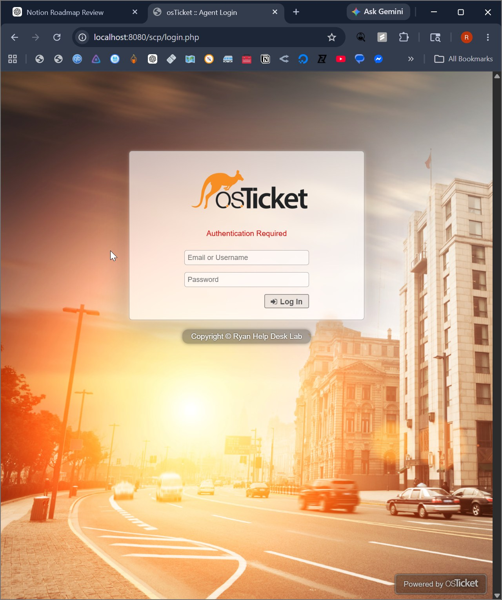

**What was completed:**  
osTicket was launched locally in a Docker-based lab environment and the staff login page loaded successfully.

**What this proves:**  
The local ticketing system is running and accessible through the browser. This is the foundation for the rest of the help desk workflow lab.

### 2. osTicket Agent Dashboard

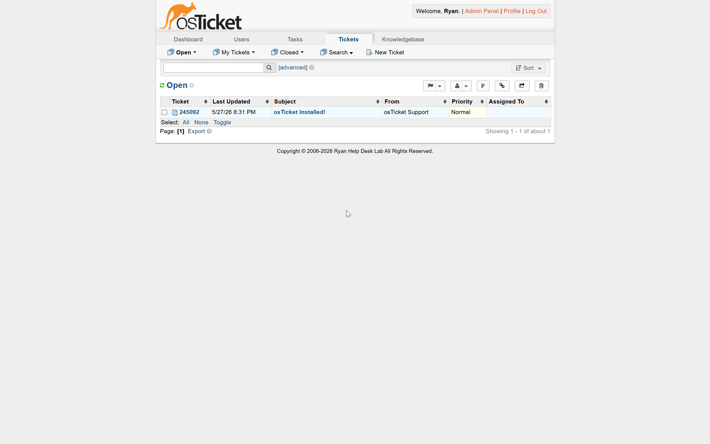

**What was completed:**  
Logged into the osTicket staff portal and captured the agent dashboard.

**What this proves:**  
The staff account can access the working ticketing environment. This confirms the lab is ready for configuration work, ticket creation, and ticket resolution documentation.

### 3. osTicket Admin System Settings Page

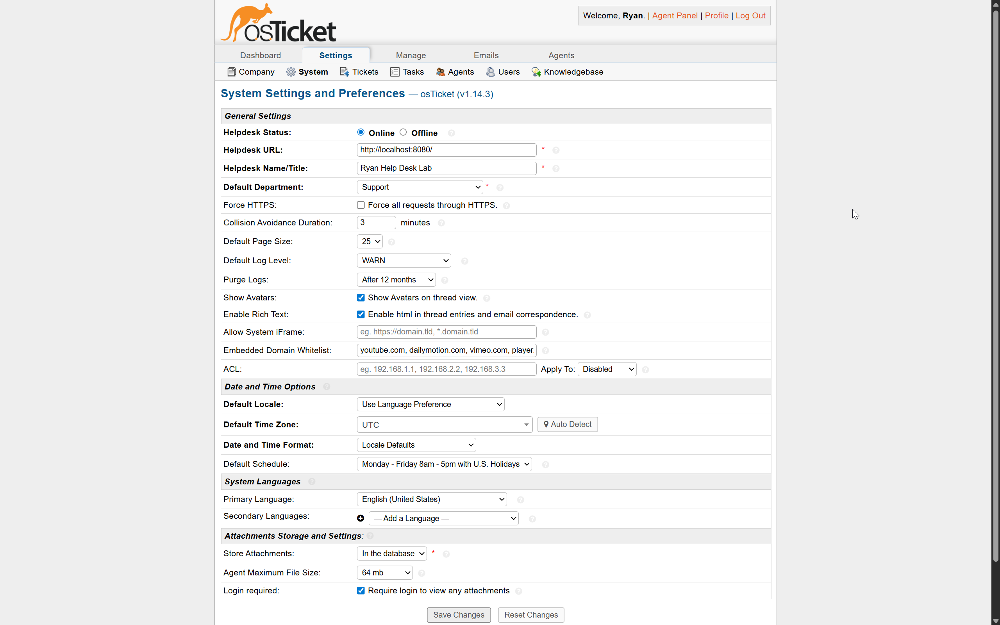

**What was completed:**  
Opened the osTicket Admin Panel and captured the System Settings and Preferences page.

**What this proves:**  
The lab has working admin access and is ready for help desk configuration work, including departments, help topics, agents, users, tickets, and system preferences.

### 4. osTicket Departments Configured

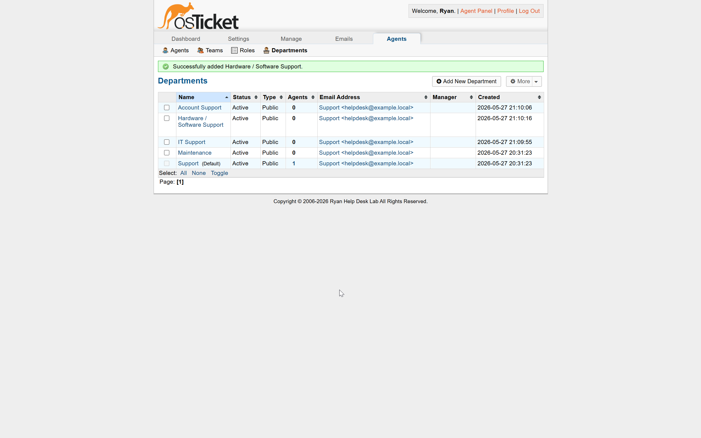

**What was completed:**  
Created and confirmed multiple departments in the osTicket Admin Panel, including IT Support, Hardware / Software Support, Account Support, and Maintenance.

**What this proves:**  
The lab now has department structure in place for ticket routing and future help desk workflow configuration.

### 5. osTicket Help Topics Configured

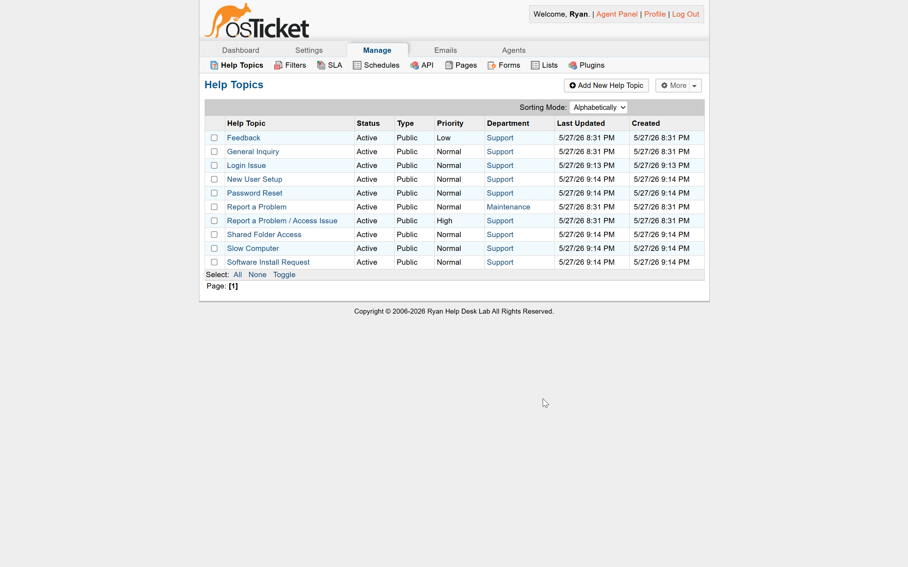

**What was completed:**  
Configured realistic help topics in the osTicket Admin Panel, including Login Issue, Password Reset, Shared Folder Access, Slow Computer, Software Install Request, and New User Setup.

**What this proves:**  
The lab now has support request categories that can be used to route and document realistic help desk tickets.

### 6. osTicket Test User Created

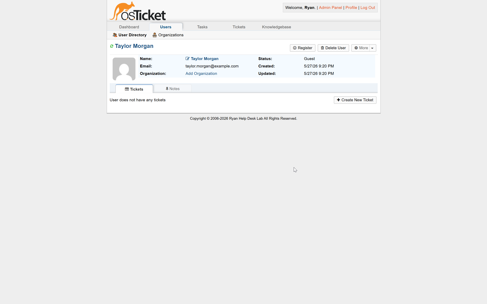

**What was completed:**  
Created a test customer/user account named Taylor Morgan for future ticket scenarios.

**What this proves:**  
The lab now has a realistic end user/customer profile that can be used to create and document support tickets.

### 7. Ticket 01 Created - User Cannot Log In

**What was completed:**  
Created the first realistic support ticket for a user who cannot log in to their company account.

**What this proves:**  
The lab now shows ticket intake from an end user, including the request summary, help topic, and ticket creation confirmation.

### 8. Ticket 01 Detail View Opened

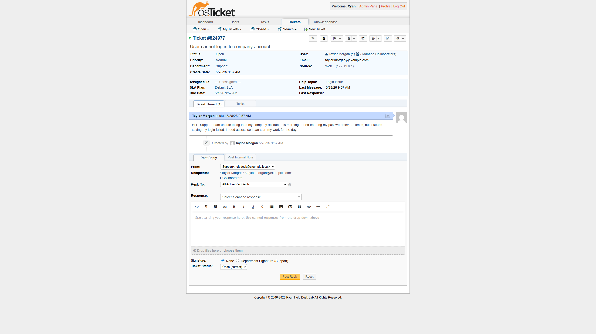

**What was completed:**  
Opened the newly created login issue ticket inside the osTicket staff panel.

**What this proves:**  
The agent can access the ticket queue, open a user request, and begin documenting troubleshooting work inside the ticketing system.

### 9. Ticket 01 Internal Note Posted

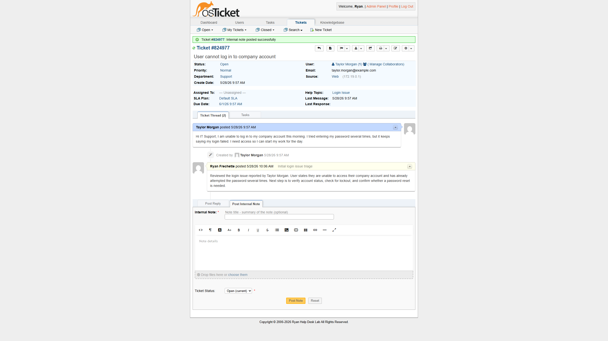

**What was completed:**  
Posted an internal troubleshooting note documenting the first triage step for the login issue.

**What this proves:**  
The ticket includes professional internal documentation, showing how an IT support agent records troubleshooting context before resolving the issue.

### 10. Ticket 01 Reply Posted and Resolved

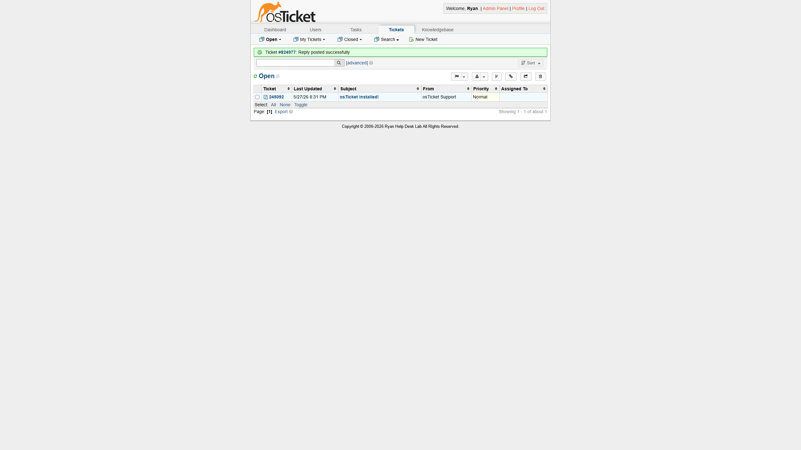

**What was completed:**  
Posted a customer-facing reply and resolved the first login issue ticket.

**What this proves:**  
The lab now demonstrates the full ticket lifecycle: intake, triage, internal note, user communication, and resolution.

### 11. Ticket 02 Created - Password Reset Request

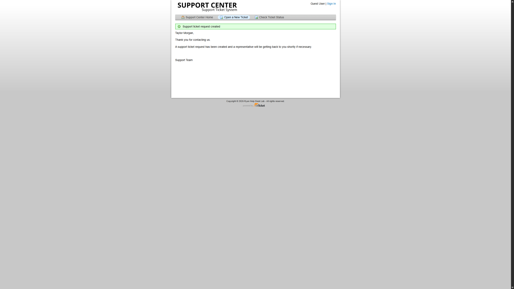

**What was completed:**  
Created the second realistic support ticket for a user requesting help with a password reset.

**What this proves:**  
The lab now includes another common help desk scenario showing ticket intake, help topic categorization, and user request documentation for an account access issue.

### 12. Ticket 02 Detail View Opened

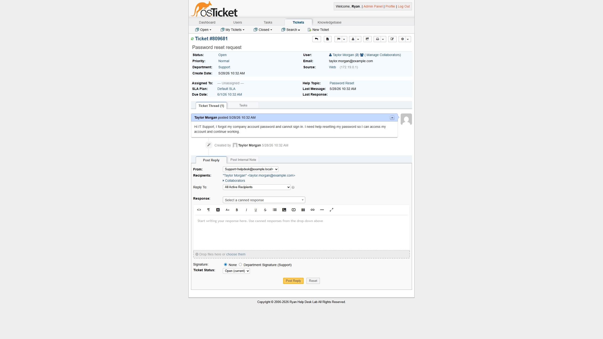

**What was completed:**  
Opened the password reset request ticket inside the osTicket staff panel.

**What this proves:**  
The agent can access and review a password reset support request, including the user details, help topic, ticket status, priority, and original request details.

### 13. Ticket 02 Internal Note Posted

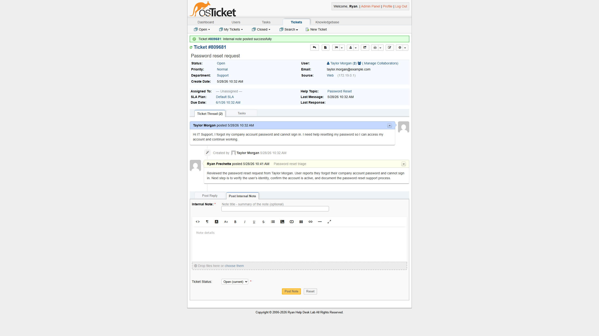

**What was completed:**  
Posted an internal troubleshooting note documenting the password reset triage process.

**What this proves:**  
The ticket includes professional internal documentation for a common help desk password reset workflow, including identity verification and account status checks.

### 14. Ticket 02 Closed Ticket List

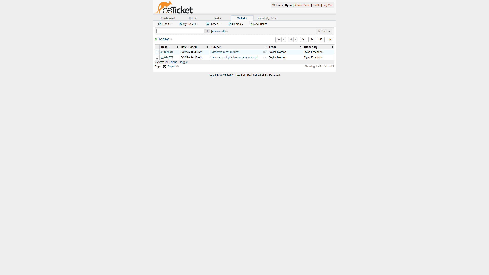

**What was completed:**  
Resolved the password reset request and confirmed it appears in the closed ticket queue.

**What this proves:**  
The lab shows a completed ticket lifecycle for a password reset request, including the closed date, ticket subject, user, and the support agent who closed it.

### 15. Ticket 03 Created - Shared Folder Access Request

**What was completed:**  
Created the third realistic support ticket for a user requesting access to a shared company folder.

**What this proves:**  
The lab now includes a permissions/access request scenario, showing ticket intake, help topic categorization, and user request documentation for a common help desk workflow.

### 16. Ticket 03 Detail View Opened

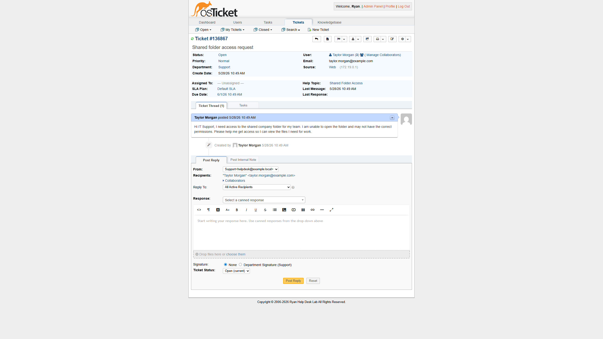

**What was completed:**  
Opened the shared folder access request ticket inside the osTicket staff panel.

**What this proves:**  
The agent can review a shared folder access request, including user details, help topic, ticket status, priority, and the original request details for a permissions-based support scenario.

### 17. Ticket 03 Internal Note Posted

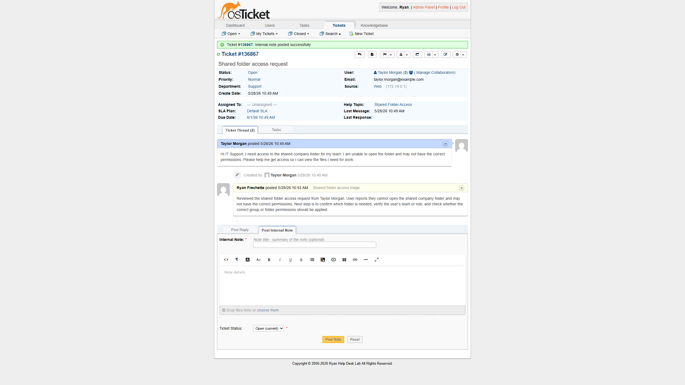

**What was completed:**  
Posted an internal troubleshooting note documenting the shared folder access triage process.

**What this proves:**  
The ticket includes professional internal documentation for a permissions-based support request, including folder access needs, user role verification, and group permission checks.

### 18. Ticket 03 Closed Ticket List

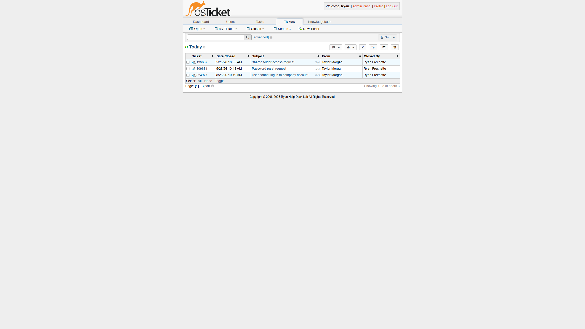

**What was completed:**  
Resolved the shared folder access request and confirmed it appears in the closed ticket queue.

**What this proves:**  
The lab shows a completed permissions/access request workflow, including the closed date, ticket subject, user, and the support agent who closed it.

### 19. Ticket 04 Created - Slow Computer

**What was completed:**  
Created the fourth realistic support ticket for a user reporting a slow computer issue.

**What this proves:**  
The lab now includes a basic troubleshooting scenario showing ticket intake, help topic categorization, and user request documentation for a common performance issue.

### 20. Ticket 04 Detail View Opened

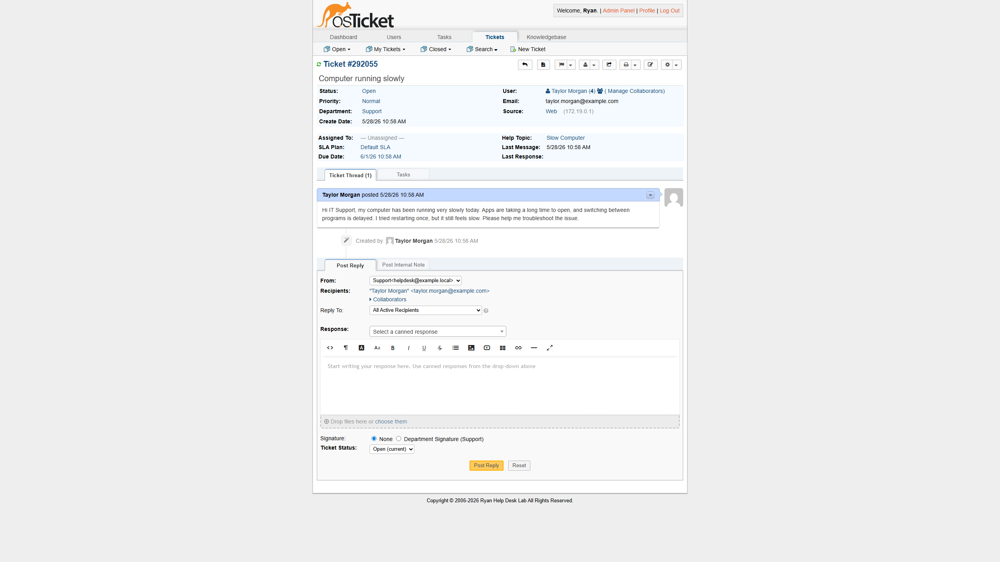

**What was completed:**  
Opened the slow computer ticket inside the osTicket staff panel.

**What this proves:**  
The agent can review a basic performance troubleshooting ticket, including user details, help topic, ticket status, priority, and the original request details.

### 21. Ticket 04 Internal Notes Posted

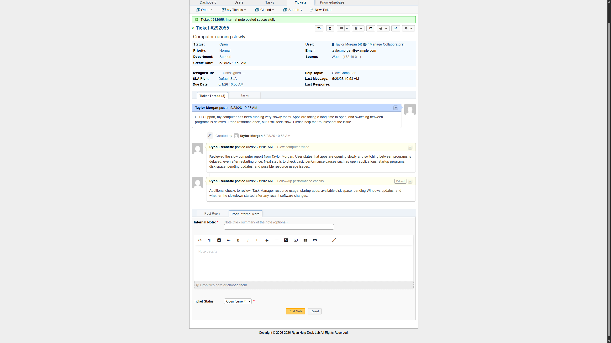

**What was completed:**  
Posted internal troubleshooting notes documenting the slow computer triage process and follow-up performance checks.

**What this proves:**  
The ticket includes professional internal documentation for a basic performance troubleshooting workflow, including startup apps, disk space, pending updates, and resource usage checks.

### 22. Ticket 04 Closed Ticket List

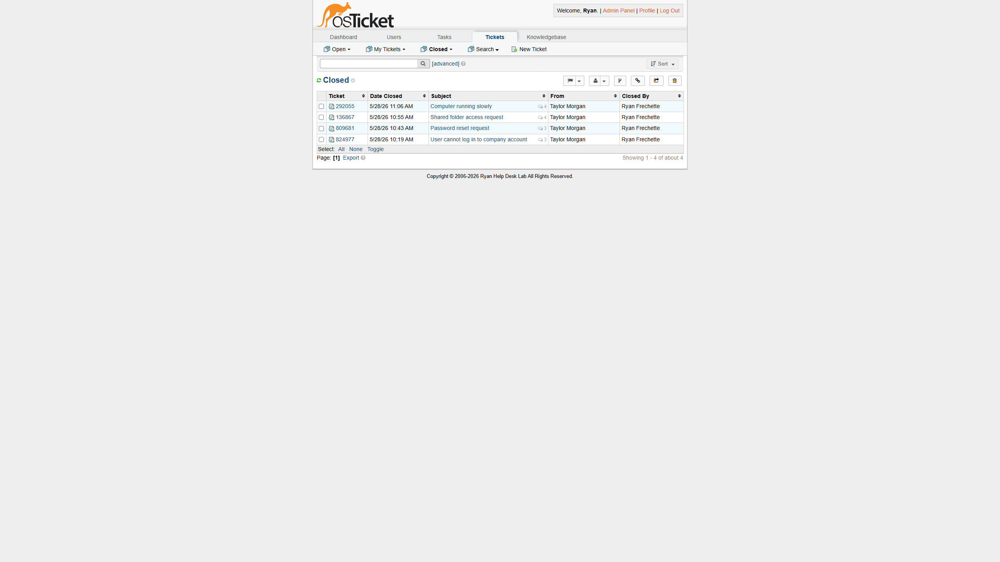

**What was completed:**  
Resolved the slow computer ticket and confirmed it appears in the closed ticket queue.

**What this proves:**  
The lab shows a completed basic performance troubleshooting workflow, including the closed date, ticket subject, user, and the support agent who closed it.

### 23. Ticket 05 Created - Software Install Request

**What was completed:**  
Created the fifth realistic support ticket for a user requesting help installing approved work software.

**What this proves:**  
The lab now includes a software installation request workflow, showing ticket intake, help topic categorization, and user request documentation for a common IT support scenario.

### 24. Ticket 05 Detail View Opened

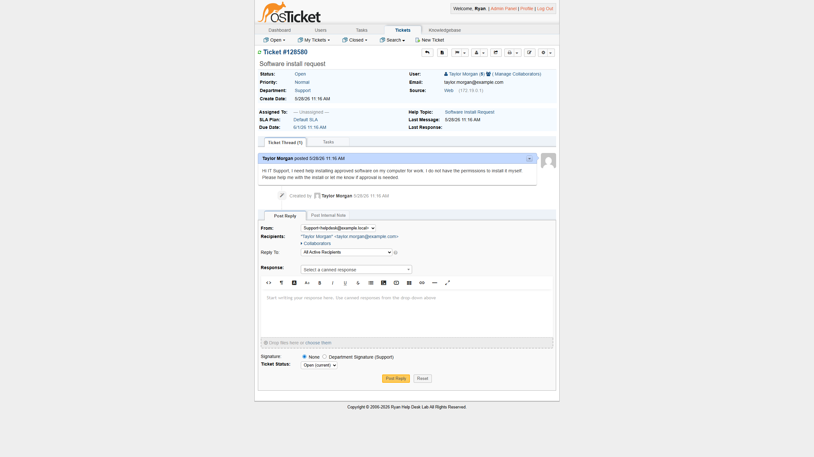

**What was completed:**  
Opened the software install request ticket inside the osTicket staff panel.

**What this proves:**  
The agent can review a software installation support request, including user details, help topic, ticket status, priority, and the original request details.

### 25. Ticket 05 Internal Note Posted

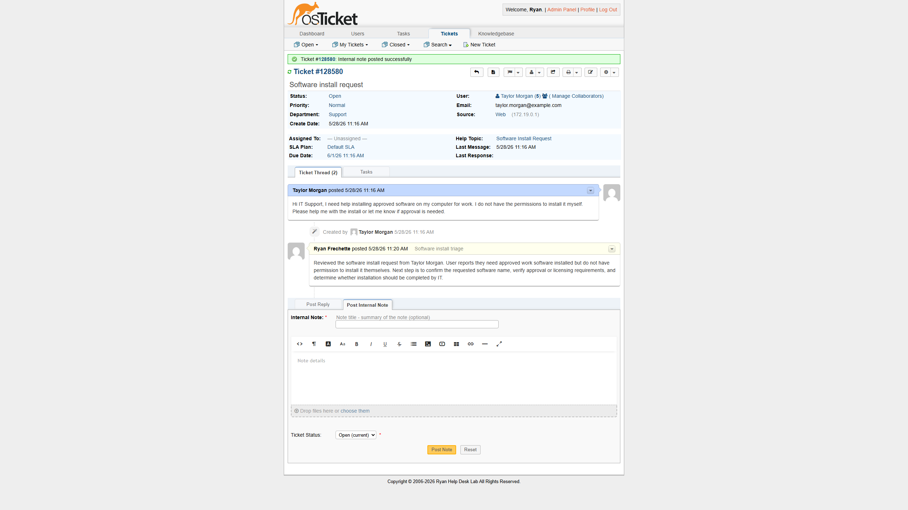

**What was completed:**  
Posted an internal troubleshooting note documenting the software install request triage process.

**What this proves:**  
The ticket includes professional internal documentation for a software installation workflow, including software name confirmation, approval/licensing review, and IT installation decision-making.

### 26. Ticket 05 Closed Ticket List

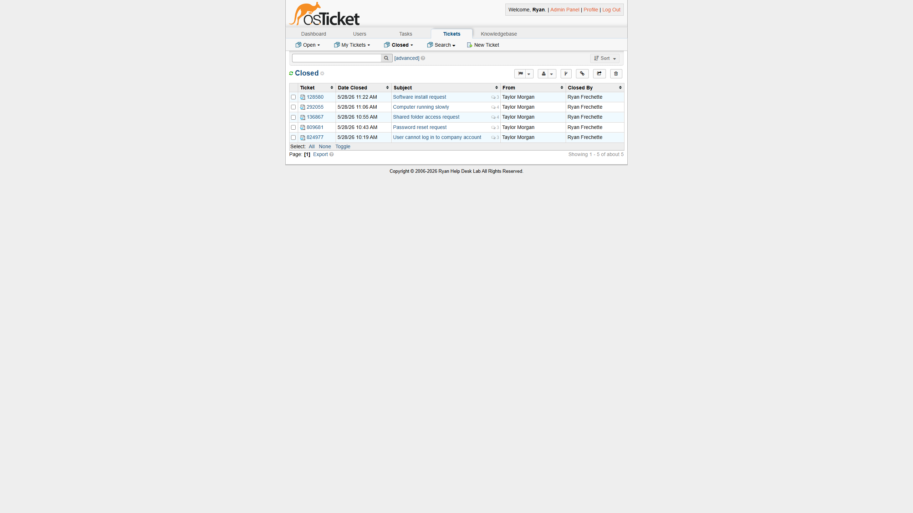

**What was completed:**  
Resolved the software install request and confirmed it appears in the closed ticket queue.

**What this proves:**  
The lab shows a completed software installation request workflow, including the closed date, ticket subject, user, and the support agent who closed it.

### 27. Ticket 06 Created - New User Onboarding

**What was completed:**  
Created the sixth realistic support ticket for a new user onboarding request.

**What this proves:**  
The lab includes an onboarding workflow showing ticket intake, help topic categorization, and setup request documentation.

### 28. Ticket 06 Detail View Opened

**What was completed:**  
Opened the new user onboarding ticket inside the osTicket staff panel.

**What this proves:**  
The agent can review onboarding request details, including account, email, application access, and shared folder permission needs.

### 29. Ticket 06 Internal Note Posted

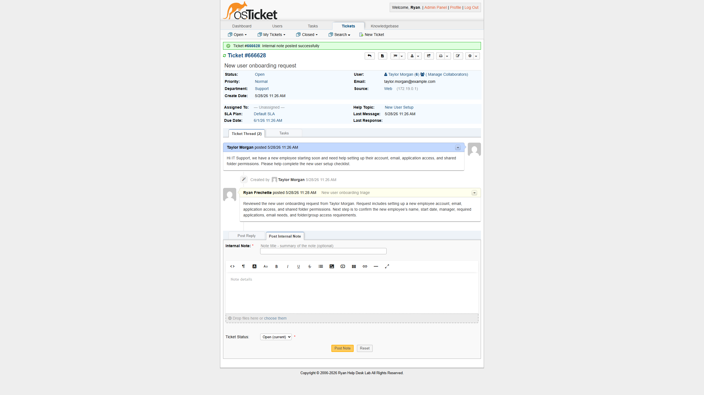

**What was completed:**  
Posted an internal note documenting the new user onboarding triage process.

**What this proves:**  
The ticket includes professional internal documentation for employee setup, including start date, manager, required applications, email needs, and group access requirements.

### 30. Ticket 06 Closed Ticket List

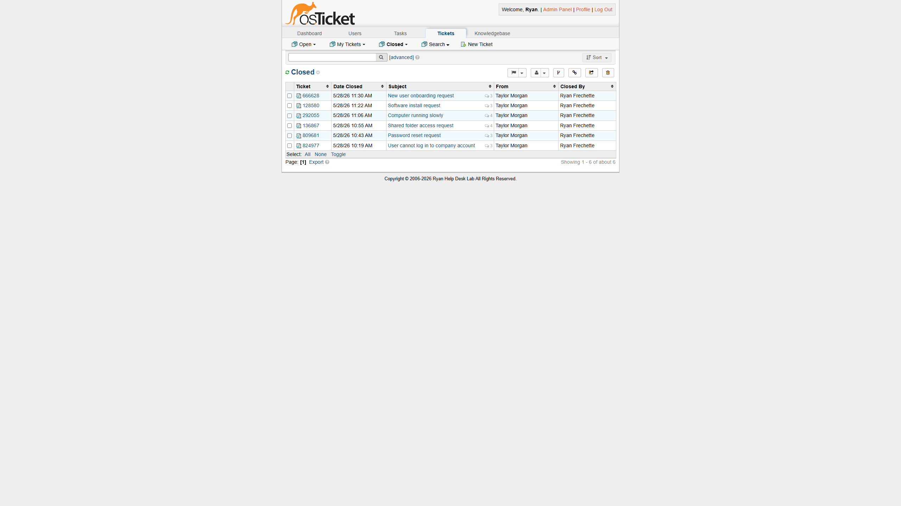

**What was completed:**  
Resolved the new user onboarding request and confirmed it appears in the closed ticket queue.

**What this proves:**  
The lab shows a completed onboarding request workflow, including the closed date, ticket subject, user, and the support agent who closed it.

## Screenshot Checklist Status

- [x] Agent dashboard
- [x] Admin dashboard
- [x] Department and help topic configuration
- [x] Ticket queue proof
- [x] Ticket detail pages
- [x] Internal note examples
- [x] Resolved / closed ticket proof
- [x] Six realistic ticket workflows

## Ticket Scenarios Completed

The finished lab includes six realistic support tickets:

1. **User Cannot Log In**  
   Simulates a common access issue where a user cannot log in and needs support triage.

2. **Password Reset Request**  
   Demonstrates identity-aware support workflow and password reset documentation.

3. **Shared Folder Access Request**  
   Shows how access issues can be documented and resolved through permissions/group access concepts.

4. **Slow Computer / Basic Triage**  
   Demonstrates basic troubleshooting questions, user communication, and escalation-style thinking.

5. **Software Install Request**  
   Simulates a request involving approval, installation, and documentation.

6. **New User Onboarding Request**  
   Shows how a help desk technician might document account setup, access needs, and onboarding tasks.

## What This Project Proves

This project shows that I can build and document a realistic help desk workflow using a professional ticketing platform.

For a hiring manager, this lab is meant to demonstrate that I understand the basics of working in an IT support queue: receiving tickets, documenting user issues, organizing work, communicating clearly, tracking progress, and closing tickets with useful resolution notes.

This project is now a clear screenshot-based help desk case study that shows practical readiness for entry-level Help Desk or IT Support work.

## Planned Final Deliverables

- Complete osTicket setup screenshots
- Six realistic ticket scenarios
- Ticket queue screenshots
- Ticket detail screenshots
- Internal note examples
- Resolved ticket examples
- Written ticket case studies
- Resume-ready bullet points
- Final polished README for portfolio use

## Repository Structure

- `README.md`
- `case-study.md`
- `resume-bullets.md`
- `PROJECT_STATE.md`
- `SESSION_LOG.md`
- `docker-compose.yml`
- `screenshots/setup/`
- `screenshots/admin-config/`
- `screenshots/tickets/`
- `tickets/`

## Final Documentation

- [Case Study](case-study.md)
- [Resume Bullets](resume-bullets.md)
- [Ticket Writeups](tickets/)

## Next Step

Add this project to the resume, LinkedIn, and portfolio website as a completed help desk ticketing project.

